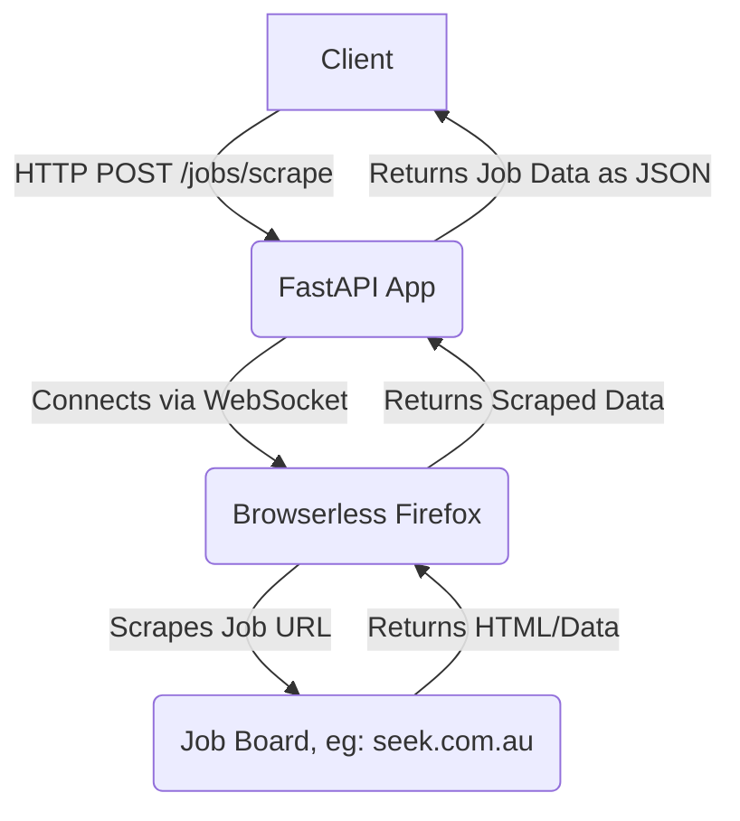

# Job Scraper Strategy

This project provides a FastAPI application that scrapes job details from various job boards using Playwright and a Browserless service.

## 1. Pre-requisites

To run this project, you will need:

*   **Docker**
*   **Docker Compose**
*   **Git**

## 2. Folder Structure

```
.
├── .dockerignore
├── .env.example
├── .gitignore
├── .python-version
├── docker-compose.yml
├── Dockerfile
├── README.md
├── requirements.txt
├── .git/
└── src/
    ├── __init__.py
    ├── api.py
    ├── deps.py
    ├── job_scrapers.py
    ├── main.py
    └── settings.py
```

## 3. Project Architecture



The project consists of a FastAPI application (`api` service) and a Browserless Firefox service (`browserless` service), orchestrated using Docker Compose.


## 4. Instructions to Clone the Project

To get a copy of the project up and running on your local machine, execute the following command:

```bash
$ git clone git@github.com:Prabeg29/job_scraper_strategy.git
$ cd job-scraper-strategy
```


## 5. Building the Docker Image

The `Dockerfile` defines a multi-stage build for the FastAPI application. To build the Docker image for the `api` service, navigate to the project root and run:

```bash
$ docker-compose build api
```

## 6. Running Up the Services with Docker Compose

To start both the FastAPI application and the Browserless service, use Docker Compose. Ensure you have a `.env` file based on `.env.example` in your project root, as the `api` service uses environment variables.

First, copy the example environment file:

```bash
$ cp .env.example .env
```

Then, run the services:

```bash
$ docker-compose up -d
```

This command will start the services in detached mode. The FastAPI application will be accessible on `http://localhost:8848` and the Browserless service on `http://localhost:3000`.

## 7. Curl Command with a Seek Job URL

Once the services are running, you can test the job scraping API using `curl`. Replace `YOUR_SEEK_JOB_URL` with an actual job listing URL from seek.com. For example:

```bash
$ curl -X POST \
  http://localhost:8848/jobs/scrape \
  -H 'Content-Type: application/json' \
  -d '{
    "job_url": "https://www.seek.com.au/job/89795419"
  }'
```
